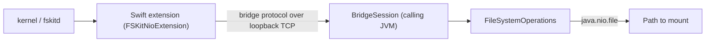

# fskit-nio-adapter

Provides directory contents specified by a `java.nio.file.Path` as an [FSKit](https://developer.apple.com/documentation/fskit) volume on macOS 27 and later, without third-party kernel or FUSE software.

The adapter registers as an `org.cryptomator.integrations.mount.MountService` named `FSKit (Experimental)`. It is an opt-in provider for early testers.

## Architecture

FSKit runs a file system as a sandboxed app extension launched by `fskitd`, while `MountService.forFileSystem(Path)` hands over a live `Path` in the caller's JVM. So the JVM that calls `mount()` serves the file system, and a thin Swift extension forwards FSKit operations to it over an authenticated loopback TCP connection:



- `mount()` starts a session on an ephemeral loopback port, writes the port and a random token into a manifest in an owner-only directory under the temp directory, and runs `/sbin/mount -F -t cryptomatorfs <that directory> <mountpoint>`.
- The extension reads the manifest, connects and presents the token. From then on it forwards the operations it supports, answers extended attributes itself, and refuses every caller but root and the user who mounted. The only file system state it holds is a map from node ids to FSKit items and the volume's size and free space as the server last reported them.
- The item table, name handling, directory listings and open channels live in Java (`org.cryptomator.frontend.fskit.fs`).
- Each volume serves its requests one at a time, end to end. Separate mounts are independent.
- The wire format is specified in [`protocol/PROTOCOL.md`](protocol/PROTOCOL.md).

This repository ships the Maven artifact `org.cryptomator:fskit-nio-adapter`, the extension sources in `fskit/`, and a stand-in host app for local testing. The mount only works while an app containing the extension is installed and the extension is enabled.

## Build and test

Java (JDK 25, on macOS or Linux, no Swift tooling needed):

```
./mvnw verify
```

The build fails on a compiler warning.

Swift (macOS 27 SDK, Swift 6.2 or later):

```
cd fskit
swift test                  # codec tests against protocol/vectors, and client tests
scripts/interop-test.sh     # Swift client against the Java server, nothing is mounted
scripts/process.sh          # SwiftFormat and SwiftLint, both have to be installed
```

The Swift sources follow [SwiftFormat](https://github.com/nicklockwood/SwiftFormat) and [SwiftLint](https://github.com/realm/SwiftLint), configured in `fskit/.swiftformat` and `fskit/.swiftlint.yml`.

To format and check what a commit contains, create `.git/hooks/pre-commit` with this content and make it executable:

```sh
#!/bin/sh
./fskit/scripts/process.sh --staged
```

When the hook reformats a staged file, it stops the commit so that the result can be reviewed. Commit again to go on.

## Install the extension

```
cd fskit
CODESIGN_IDENTITY="Apple Development: …" \
PROVISIONING_PROFILE=<profile for the extension's bundle identifier> \
scripts/package.sh

ditto build/FSKitNioHost.app /Applications/FSKitNioHost.app
codesign --verify --deep --strict /Applications/FSKitNioHost.app  # must pass
open /Applications/FSKitNioHost.app
```

Then enable "Cryptomator FSKit File System Extension" in System Settings > General > Login Items & Extensions > File System Extensions (in the "By Category" view). `pluginkit -m | grep -i fskit` lists the extension once it is registered. macOS switches the extension off again when a reinstalled build has a changed `Info.plist`.

For a file system type that no extension provides, `mount` exits with status 69 and `mount: Unable to invoke task`. With the extension disabled, it additionally prints `Module <bundle identifier> is disabled!`.

`package.sh` reads these environment variables:

| Variable | Default | Meaning |
| --- | --- | --- |
| `CODESIGN_IDENTITY` | `-` (ad-hoc) | Signing identity |
| `PROVISIONING_PROFILE` | none | Profile to embed into the extension |
| `HOST_BUNDLE_ID` | `org.cryptomator.fskit.host` | Bundle identifier of the host app. The extension's is this plus `.extension`. |
| `FS_TYPE_NAME` | `cryptomatorfs` | File system type name, as passed to `mount -t` |
| `SKIP_SWIFT` | unset | Set to `1` to skip `swift build` |

A build with a different `FS_TYPE_NAME` needs the JVM started with `-Dorg.cryptomator.frontend.fskit.fsType=<name>`.

### Signing

The extension carries the restricted `com.apple.developer.fskit.fsmodule` entitlement, which must be backed by a provisioning profile that authorizes it for the extension's bundle identifier. ExtensionKit refuses to launch an unprovisioned extension, so an ad-hoc build compiles and registers but cannot mount. Any Apple-issued identity works, including a free "Apple Development" certificate. Hardened runtime and notarization are not needed for local development.

A broken seal fails opaquely: `fskitd` does not launch a bundle whose signature is invalid, and the only symptom is `mount: Unable to invoke task`. After replacing the installed app, always check it with `codesign --verify --deep --strict`.

## Mirroring test

With the extension installed and enabled, `MirroringFSKitMountTest` mounts directories or a vault interactively. In either mode the JVM logs every request with its response at trace level.

Mirror one or more directories (prompts for pairs of directory and mount point, and for read-only):

```
./mvnw test -Pmirror
```

Mirror a vault (prompts for the vault, its passphrase, the mount point, and for read-only):

```
./mvnw test -Pcrypto-mirror
```

## Smoke test

With the extension installed and enabled, and built with the default `FS_TYPE_NAME`, the smoke test mounts directories and a throwaway vault, works on them through the shell, and scans the JVM's log for failures:

```
fskit/scripts/smoke-test.sh
```

It does not cover Finder, a disabled extension, a killed extension process or a killed JVM. The scenario `access` checks that another account is refused. It joins the run only when `SMOKE_OTHER_ACCOUNT` names a second account, which `sudo -n -u` has to reach without a password:

```
SMOKE_OTHER_ACCOUNT=<account> fskit/scripts/smoke-test.sh
```

The script's header lists its arguments, scenarios, environment and exit statuses.

## Known limitations

Observed on macOS 27.0.1 with JDK 26.

- Another account gets "Permission denied" on a mounted volume, but root reads and changes it like the user who mounted it. An account that can get to the mount point is not kept from everything:
  - It can enter the volume's root and a directory the mounting user has accessed, though not list them. While it stays there, the volume can only be unmounted by force.
  - For an entry the mounting user has accessed, `stat` answers with the entry's attributes, such as its size, from the kernel's cache.
  - Removing such an entry reports success, although nothing is removed.
  - Extended attribute calls by path on such an entry are not refused. They reveal nothing, and what they set is discarded.
  - An FSEvents stream on the mount point reports the paths of entries as they change.
  - For a symbolic link the mounting user has read, `readlink` answers with the target. Reading a file of the volume through the link is still refused.

  A mount point below a directory the other account cannot enter keeps all of this from it.
- Finder's Trash creates `.Trashes` in the volume root, which appears in the mounted `Path`.
- The name `.fseventsd` in the volume root is taken. The volume shows a directory of that name with an empty file `no_log` in it, which keeps macOS from creating the directory in the mounted `Path` and storing its log of file system events there. Neither is stored or can be changed, and the root's listing leaves the directory out. An entry named `.fseventsd` that the mounted `Path` already holds cannot be reached through the volume and stays as it is. Without that log, macOS has no event history for the volume, and an FSEvents stream created relative to the device reports absolute paths. Events are still delivered as they happen.
- Hard links cannot be created: `ln` fails with "Operation not supported".
- macOS follows a symbolic link itself. A relative target leads to an entry of the volume, an absolute one into the Mac's own file system and not into the mounted `Path`.
- A symbolic link created on the volume has its target without a trailing slash and without doubled slashes: `ln -s dir/ name` stores `dir`. A vault also stores the target in composed Unicode form.
- A symbolic link whose target is longer than 1023 bytes cannot be read or followed: `readlink` and `cat` fail with "File name too long", `ls -l` lists it without a target, and Finder shows it with a question mark. A vault can hold such a link, but none can be created on the volume.
- A change to the mode or the times of a symbolic link reports success and has no effect (`chmod -h`, `touch -h`).
- A symbolic link whose target is not valid UTF-8, which a plain directory can hold, is shown with the invalid bytes replaced by `�`, so it leads elsewhere or nowhere.
- Extended attributes are accepted and not stored: `xattr -w` succeeds, and the attribute is gone. A file copied or saved to the volume loses its Finder tags, its resource fork and its quarantine flag, which marks a download for the check macOS runs before opening it.
- An extended attribute or resource fork from 256 KiB up to at least 1 MiB is refused with "File too large". `cp` then copies the data, reports that it could not copy the extended attributes and exits with status 1, while Finder copies such a file without complaint. One of 2 MiB or more is accepted.
- One slow operation stalls its volume, since requests are served one at a time.
- Work on many small files takes longer than through macFUSE. On a vault, creating or removing 5,000 files or a first `ls -l` of them takes three to five times as long, and reading them two and a half times. Every request macOS sends is a round trip through the extension to the JVM, which takes about 0.1 ms. It sends more requests than an operation needs: `ls -l` looks up every entry again after listing it, and each first lookup of an entry is followed by one for its `._` companion.
- On a plain directory, creating an entry or looking one up by name for the first time takes longer the more entries its directory holds, because the JDK lists that directory to find the name as it is stored. With 5,000 files in one directory, creating them takes 14 s and `ls -l` 9 s, against 7 s and 2 s on a vault.
- A FIFO or a socket in the mounted `Path` is shown as a regular file. Opening the socket fails with "Input/output error". Opening the FIFO stalls the whole volume until a process opens it for writing in the mounted `Path` itself, not through the volume.
- Nothing else may modify the mounted `Path` while it is mounted.
- The mounted `Path` must not hold two names that differ only in Unicode normalization.
- The volume is case-sensitive: on a case-insensitive backing store, a name that differs from an existing one only in case is reported as absent and cannot be created.
- Replacing a file that is open (`mv` onto it) fails with "Resource busy" on a vault, because cryptofs refuses to replace an open file. It works on a plain directory.
- A time or permission change on a removed file that is still open is ignored.
- A modification or access time cannot be set on a file or directory whose owner may not read it: `touch` fails with "Permission denied", because the JDK opens the entry for reading to set its times.
- One request can change several attributes, as `setattrlist` does. When the backing store refuses one of them after another has been applied, the request still succeeds, and only the JVM's log reports the refusal.
- A file or directory is created even when the backing store refuses to set its mode. It then keeps the mode it was created with, which the umask of the JVM may have cut down. Only the JVM's log reports the refusal.
- A modification or access time later than 11 April 2262, 23:47:16 UTC, is set to that time, the latest the JDK sets.
- A rename that replaces an existing entry is atomic only when a file replaces a file. With a directory or a symbolic link on either side, the target is removed first and is gone if the move then fails.
- A file that was opened for writing only and then loses its owner-write permission cannot be opened for reading until it is closed.
- A mount does not survive its JVM. When the JVM dies, operations on the volume fail with an I/O error at once, and `umount -f` removes the mount. The directory holding the manifest stays in the temp directory.
- A mount does not survive its extension process either. When the process dies, macOS removes the mount at once, and an operation in flight fails with "Device not configured". The mount point is a plain directory again, so whatever is written to it afterwards lands in that directory, not in the mounted `Path`.
- The provider is offered on every Mac running macOS 27 or later, whether or not the extension is installed and enabled. If it is not, `mount()` fails with `MountFailedException`.

## License

This project is dual-licensed under the AGPLv3 for FOSS projects as well as a commercial license for independent software vendors and resellers. If you want to use this library in applications, that are *not* licensed under the AGPL, feel free to contact our [support team](https://cryptomator.org/help/).
